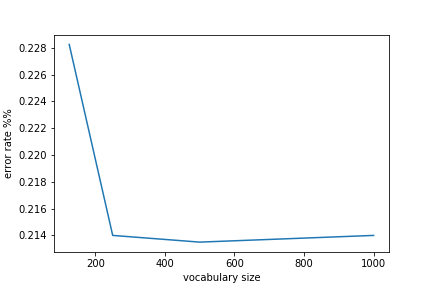
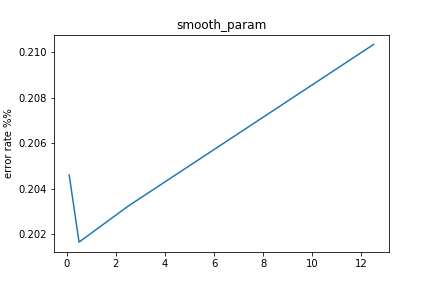

## Requirements:
  We have three datasets collected from three domains: imdb.com, amazon.com, yelp.com. Each dataset consists of sentences with sentiment labels (1 for positive and 0 for negative) extracted from . These form 3 datasets for the assignment.
  Each dataset is given in a single text file, with each line as an instance. Each line is a list of space separated words, which essentially a sentence, followed by a tab character, and then followed by the label. Here is a snippet from the yelp dataset:
      Crust is not good. 0 
      Best burger ever had! 1
  You are suggested to remove all the punctuation, numeric values, and convert upper case to lower case for each example so that the same word will treated in the same way in the data.

  In this assignment you are ask to implement a Naive Bayes classifier, 
  which has been discussed in class, to predict sentiment labels of sentences.

## Experiments:

  1) Run Naive Bayes with smoothing parameter m = 0.1, 0.5, 2.5, 12.5. 
    Plot the cross validation performance as a function of the smoothing parameter. What observations can you make about the results?

  2) Choose a small vocabulary (size d) of words and check whether how the performance changes. 
    Try different d values, 1000, 500, 250, 125, and report what performance you get for these different sizes of vocabulary.
    
    
## Manual, Project 1 Machine Learning 135
Jqu03

0) To execute, 
    there is no need to modify the code for different file name, 
    simply type the following in prompt:
    
    > python3 firstPythonProject_jqu03.py

    In the prompt, it would print a list of .txt file in current directory:

    ---
           file 0 is amazon_cells_labelled.txt
           file 1 is otherfiles.txt
           file 2 is yelp_labelled.txt
           file 3 is yourfiles_copy.txt
           file 4 is imdb_labelled.txt
    ---

    Enter the file's index: <0, 1, 2,...>: 
    >[Type your desired index number HERE]

1) Schema Behind:
    <a> prior setting: 
        remove the most freq 90% words: 
            max_df=.9
        remove stop words: 
            stop_words='english'
        tokenize the words: 
            stemmer: (remove tense) 
        translator: (remove punctuation and digits)
        [ NOTE ] for slash ['/'] replace it with a space char [' '] 
            e.g. "with/without" -> "with", "without"
        the ratio of [training data: tnd] : [test data: tsd] 
            9:1 -> ten per cent -> 0.1 

    <b> parameters:
        smoothing_parameter: 0.1, 0.5, 2.5, 12.5
        dictionary size:  1000, 500, 250, 125

    <c> pseudo code of main function:
        for each [smoothing_parameter: sp_i]:
            dictionary size = 1000
            for [seeds_number: sn_j] in range(0~99):
                split data into [tnd & label] [tsd & label] (using [sn_j]) 
                train a model using [tnd/label]
                    where trained_model = [p(x_j=1|y=1),p(x_j=1|y=1)] 
                test using [tsd & label]  [trained_model]
                error_rate = [(evaluate(Y_test, Y_pred))]
                find the average of [error_rate]
        plot [average_error_rate] against [smoothing_parameter]

        do the same thing for each [dictionary_size: sp_i]
            in this case: smoothing_parameter = 0.1
        plot [average_error_rate] against [dictionary_size]

    [ NOTE ] 
        training data: tnd
        test data: tsd

2) Package Used:
    to get the .txt files in current directory:
    > import glob

    for preprocessing including:
      instance splitting, 
      word tokenization and vectorization:
    > import sklearn, nltk, string
    > from sklearn.model_selection import train_test_split
    
    > from sklearn.feature_extraction.text import CountVectorizer
    
    to calculate the probability, use numpy
    > import numpy
    
    to throw the error:
    > import sys

    for the boundary cases where prediction of 1 == prediction of 0:
    > import random

    to plot the figure:
    > import matplotlib
    > matplotlib.use('Agg') 
    >	import matplotlib.pyplot as plt 

    [ NOTE ] 
        to use nltk package:
        
        > nltk.download('punkt')
